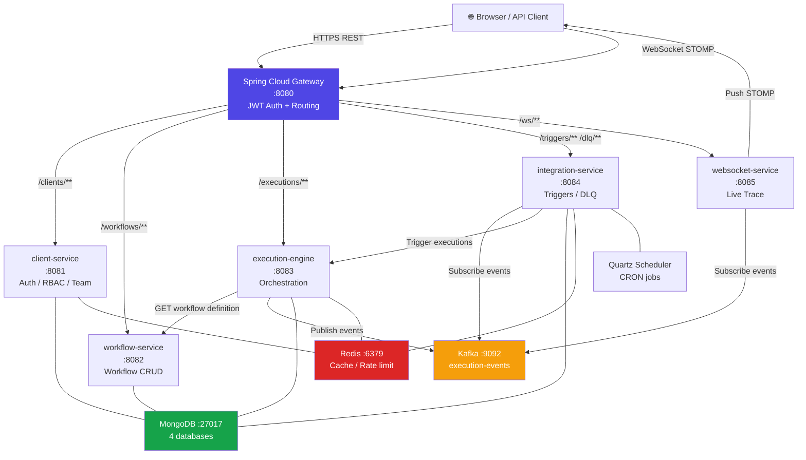
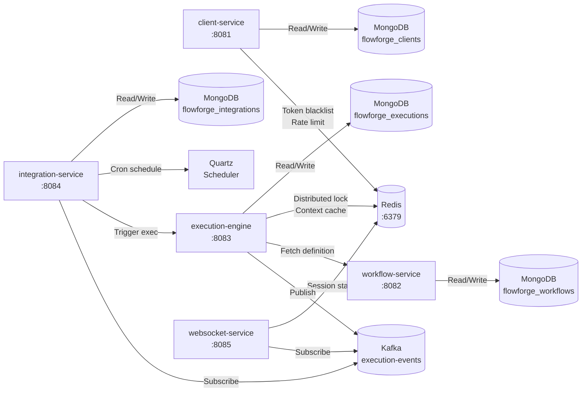
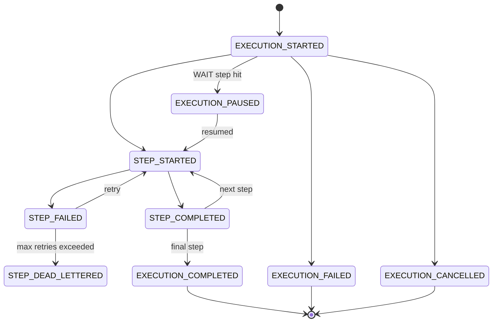
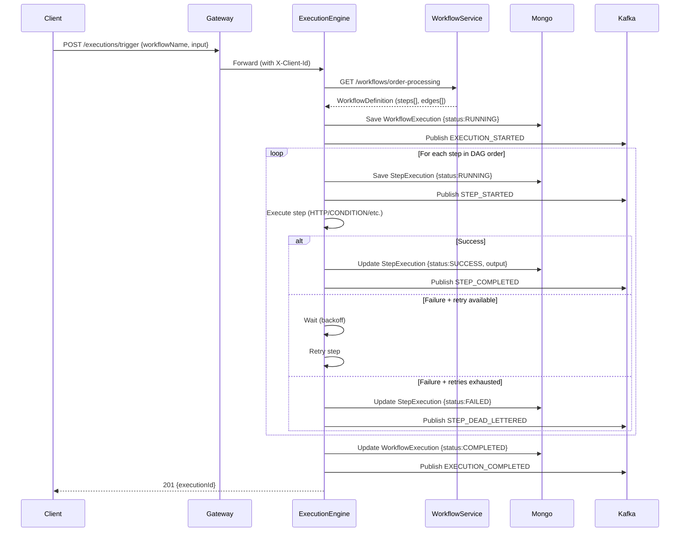
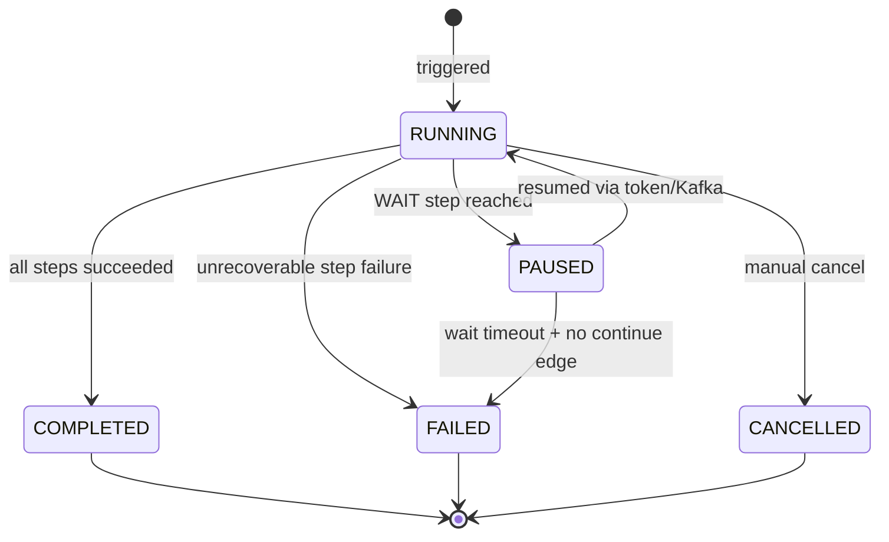

# FlowForge — Full Technical Documentation

> **Version:** 1.0.0 · **Java:** 17 · **Spring Boot:** 3.2.0 · **Node:** 18+

---

## Table of Contents

1. [Project Overview](#1-project-overview)
2. [High-Level Architecture](#2-high-level-architecture)
3. [Service Inventory](#3-service-inventory)
4. [Infrastructure Components](#4-infrastructure-components)
5. [Authentication & Security Model](#5-authentication--security-model)
6. [Kafka Messaging Architecture](#6-kafka-messaging-architecture)
7. [Execution Engine Deep Dive](#7-execution-engine-deep-dive)
8. [Integration & Trigger System](#8-integration--trigger-system)
9. [Frontend Architecture](#9-frontend-architecture)
10. [MongoDB Schema Reference](#10-mongodb-schema-reference)
11. [Complete API Reference](#11-complete-api-reference)
12. [Data Flow Walkthroughs](#12-data-flow-walkthroughs)
13. [Developer Setup Guide](#13-developer-setup-guide)
14. [Configuration Reference](#14-configuration-reference)
15. [Dummy / Demo Mode](#15-dummy--demo-mode)
16. [AI Features](#16-ai-features)

---

## 1. Project Overview

**FlowForge** is a multi-tenant enterprise workflow automation platform that allows organizations to design, deploy, and monitor complex business workflows visually. Workflows are composed of typed steps (HTTP calls, conditions, loops, scripts, notifications, etc.), wired together into directed acyclic graphs (DAGs). They can be triggered via REST API, incoming webhooks, Kafka events, or cron schedules.

### Key Capabilities

| Capability | Details |
|---|---|
| **Visual DAG Designer** | Drag-and-drop React Flow canvas with per-step configuration |
| **Multi-Tenant Auth** | JWT-based per-organization isolation with RBAC |
| **9 Step Types** | HTTP, Condition, Loop, Delay, Script, Notify, Sub-Workflow, Wait, **AI Call** |
| **4 Trigger Types** | API, Webhook (inbound HMAC), Kafka, Cron |
| **AI Call Step** | Call Claude (Anthropic) inline in any workflow — dynamic prompts with `${...}` interpolation |
| **AI Execution Analyst** | One-click `Explain Failure` on any failed execution — Claude diagnoses root cause and suggests fixes |
| **Inbound Webhooks** | Generic `POST /api/v1/triggers/webhook/{clientId}/{triggerId}` with HMAC-SHA256 signing |
| **Live Execution Trace** | WebSocket-powered real-time step status overlay |
| **Dead Letter Queue** | Per-step failure capture with replay and discard |
| **Wait States** | Pause execution mid-flow and resume via token or Kafka event |
| **Execution History** | Full audit trail with HTTP request/response logs per step |
| **Rate Limiting** | Per-client and per-workflow concurrent execution caps |
| **Developer Portal** | API key management, SDK docs, interactive reference |

---

## 2. High-Level Architecture

### System Context Diagram

```
╔══════════════════════════════════════════════════════════════════════════╗
║                         FlowForge Platform                               ║
║                                                                          ║
║  ┌──────────────┐     HTTPS      ┌─────────────────────────────────┐    ║
║  │  Browser /   │◄──────────────►│   Spring Cloud Gateway  :8080   │    ║
║  │  Mobile App  │   REST + WS    │   (JWT Auth + Routing)          │    ║
║  └──────────────┘                └──────┬──────┬──────┬──────┬─────┘    ║
║                                         │      │      │      │          ║
║  ┌──────────────┐   ┌─────────────┐  ┌──▼───┐ │   ┌──▼──┐   │          ║
║  │  External    │   │ client-svc  │  │  wf  │ │   │exec │   │          ║
║  │  Webhooks /  │   │   :8081     │  │  svc │ │   │ eng │   │          ║
║  │  SNS / Kafka │   │  Auth+RBAC  │  │ :8082│ │   │:8083│   │          ║
║  └──────┬───────┘   └─────────────┘  └──────┘ │   └──┬──┘   │          ║
║         │                                       │      │      │          ║
║  ┌──────▼──────────────────────┐     ┌─────────▼──┐   │   ┌──▼────┐    ║
║  │   integration-service :8084 │     │ websocket  │   │   │ Redis │    ║
║  │  Kafka Consumer + Quartz    │     │  svc :8085 │   │   │ :6379 │    ║
║  └──────────┬──────────────────┘     └────────────┘   │   └───────┘    ║
║             │                               ▲          │                ║
║  ┌──────────▼──────────────────────────────┘──────────▼──┐             ║
║  │              Apache Kafka  :9092                        │             ║
║  │              Topic: execution-events                    │             ║
║  └─────────────────────────────────────────────────────────┘             ║
║                                                                          ║
║  ┌─────────────────────────────────────────────────────────┐             ║
║  │              MongoDB :27017 (4 databases)                │             ║
║  └─────────────────────────────────────────────────────────┘             ║
╚══════════════════════════════════════════════════════════════════════════╝
```

### Microservice Communication Map



---

## 3. Service Inventory

### Overview Table

| Service | Port | Language | Database | Key Responsibilities |
|---|---|---|---|---|
| **Gateway** | 8080 | Java 17 / Spring Cloud | Redis | JWT validation, routing, CORS, rate limit enforcement |
| **client-service** | 8081 | Java 17 / Spring Boot | MongoDB `flowforge_clients` | Auth, multi-tenancy, RBAC, API keys, audit logs |
| **workflow-service** | 8082 | Java 17 / Spring Boot | MongoDB `flowforge_workflows` | Workflow CRUD, publish/rollback, validation |
| **execution-engine** | 8083 | Java 17 / Spring Boot | MongoDB `flowforge_executions` | Execution orchestration, step runners, retry, Wait states |
| **integration-service** | 8084 | Java 17 / Spring Boot | MongoDB `flowforge_integrations` | Kafka triggers, cron, SNS, DLQ replay, webhooks |
| **websocket-service** | 8085 | Java 17 / Spring Boot | — | Kafka→STOMP relay for live execution trace |
| **flowforge-common** | — | Java 17 (JAR lib) | — | Shared models, JWT util, tenant context, exceptions |
| **flowforge-ui** | 3000 | React 18 / TypeScript | — | Visual designer, execution monitor, admin console |

---

### 3.1 API Gateway (`:8080`)

The gateway is the **single entry point** for all external traffic. No internal service is reachable directly.

```
Request arrives
    │
    ▼
┌─────────────────────────────────┐
│  JwtAuthFilter                  │
│  • Reads Authorization header   │
│  • Validates HS256 signature    │
│  • Extracts clientId + userId   │
│  • Injects X-Client-Id header   │
│  • Injects X-User-Id header     │
│  • Skips: /register, /login     │
└──────────────┬──────────────────┘
               │
    ▼
┌─────────────────────────────────┐
│  RouteConfig                    │
│  • Pattern match on path        │
│  • Route to direct http://host  │  (no Eureka / service discovery)
│  • Strip /api/v1 prefix where   │
│    needed                       │
└─────────────────────────────────┘
```

**Route Table:**

| Pattern | Upstream Service |
|---|---|
| `POST /api/v1/clients/register` | `http://localhost:8081` — public |
| `POST /api/v1/clients/login` | `http://localhost:8081` — public |
| `/api/v1/clients/**` | `http://localhost:8081` |
| `/api/v1/users/**` | `http://localhost:8081` |
| `/api/v1/roles/**` | `http://localhost:8081` |
| `/api/v1/api-keys/**` | `http://localhost:8081` |
| `/api/v1/audit-logs/**` | `http://localhost:8081` |
| `/api/v1/analytics/**` | `http://localhost:8081` |
| `/api/v1/workflows/**` | `http://localhost:8082` |
| `/api/v1/executions/**` | `http://localhost:8083` |
| `/api/v1/triggers/**` | `http://localhost:8084` |
| `/api/v1/dlq/**` | `http://localhost:8084` |
| `/api/v1/webhooks/**` | `http://localhost:8084` |
| `/ws/**` | `http://localhost:8085` |

---

### 3.2 Client Service (`:8081`)

Handles everything related to **organizations, users, access control, and platform administration**.

```
flowforge-client-service
├── controllers/
│   ├── ClientController       → /api/v1/clients/**
│   ├── UserController         → /api/v1/users/**
│   ├── RoleController         → /api/v1/roles/**
│   ├── ApiKeyController       → /api/v1/api-keys/**
│   ├── AuditController        → /api/v1/audit-logs/**
│   └── AnalyticsController    → /api/v1/analytics/**
├── services/
│   ├── AuthService            → JWT generation + validation
│   ├── ClientService          → Org lifecycle
│   ├── UserService            → Team member CRUD
│   ├── RbacService            → Role + permission checks
│   ├── ApiKeyService          → Key generation + BCrypt hash
│   └── AuditServiceImpl       → Immutable audit trail writer
├── repositories/
│   ├── ClientRepository
│   ├── ClientUserRepository
│   ├── RoleRepository
│   ├── ApiKeyRepository
│   ├── EnvVariableRepository
│   └── AuditEventRepository
└── config/
    ├── SecurityConfig         → Spring Security (JWT filter)
    ├── JwtAuthenticationFilter
    ├── MongoConfig
    └── GlobalExceptionHandler
```

**Built-in Roles (default seeded):**

| Role | Permissions |
|---|---|
| `ADMIN` | All permissions |
| `DEVELOPER` | `workflow:*`, `execution:*`, `trigger:*`, `dlq:*` |
| `WORKFLOW_VIEWER` | `workflow:view`, `execution:view` |
| `TRIGGER_ONLY` | `execution:trigger` |

---

### 3.3 Workflow Service (`:8082`)

Stores and versions **workflow definitions**. Does not execute them.

```
flowforge-workflow-service
├── controllers/
│   └── WorkflowController
│       ├── GET    /workflows              → list (paginated, filterable)
│       ├── POST   /workflows              → create
│       ├── GET    /workflows/:name        → get latest
│       ├── PUT    /workflows/:name        → update (creates new draft)
│       ├── DELETE /workflows/:name        → soft-delete
│       ├── POST   /workflows/:name/publish → publish current draft
│       ├── POST   /workflows/:name/rollback → rollback to version N
│       ├── POST   /workflows/:name/clone  → duplicate
│       ├── POST   /workflows/:name/validate → static validation
│       └── GET    /workflows/:name/versions → version list
└── services/
    ├── WorkflowService
    ├── WorkflowVersionService  → tracks immutable version snapshots
    └── WorkflowValidationService → checks for orphaned steps, cycle detection
```

**Supported Step Types:**

| Type | Description | Config Fields |
|---|---|---|
| `HTTP` | Outbound REST call via WebClient | `method`, `url`, `headers`, `body`, `timeout` |
| `CONDITION` | SpEL boolean expression, branches to SUCCESS or FAILURE edge | `expression` |
| `LOOP` | Iterates over a list in the execution context | `listPath`, `itemVariable` |
| `DELAY` | Pauses execution for a fixed duration | `durationMs` |
| `SCRIPT` | Groovy 4 script with sandboxed context access | `script`, `language` |
| `NOTIFY` | Sends Email or Slack message | `channel`, `template`, `recipient` |
| `SUB_WORKFLOW` | Invokes a child workflow synchronously | `workflowName`, `inputMapping` |
| `WAIT` | Halts execution until resumed via token or Kafka event | `timeoutMinutes`, `resumeContextKey` |
| `AI_CALL` | Calls Anthropic Claude API with a dynamic prompt | `model`, `systemPrompt`, `userPrompt`, `maxTokens`, `temperature` |

---

### 3.4 Execution Engine (`:8083`)

The **heart of FlowForge**. Receives trigger requests, loads workflow definitions, executes steps in order, handles retries, and publishes events to Kafka.

```
TriggerExecutionRequest (POST /executions/trigger)
        │
        ▼
┌─────────────────────────┐
│  WorkflowOrchestrator   │
│  loadWorkflow()         │──► GET :8082/workflows/:name
│  initContext()          │
│  walkDAG()              │
└──────────┬──────────────┘
           │  for each step in topological order
           ▼
┌─────────────────────────┐
│  ContextResolver        │
│  Resolve ${...} exprs   │
│  Inject step output     │
└──────────┬──────────────┘
           │
           ▼
┌─────────────────────────────────────────────────────┐
│  StepExecutor (dispatcher)                           │
│                                                       │
│  HTTP       → HttpStepExecutor (WebClient)           │
│  CONDITION  → ConditionStepExecutor (SpEL)           │
│  LOOP       → LoopStepExecutor                       │
│  DELAY      → DelayStepExecutor                      │
│  SCRIPT     → ScriptStepExecutor (Groovy sandbox)    │
│  NOTIFY     → NotifyStepExecutor                     │
│  SUB_WORKFLOW→ SubWorkflowExecutor                   │
│  WAIT       → WaitStepExecutor (polls MongoDB / 3s)  │
└──────────┬──────────────────────────────────────────┘
           │  on completion
           ▼
┌─────────────────────────┐
│  ExecutionEventPublisher│──► Kafka topic: execution-events
│  StepExecutionRepository│──► MongoDB: step_executions
└─────────────────────────┘
```

**Retry Policy Logic:**

```
Step fails
    │
    ├── retryPolicy.maxRetries > 0?
    │       YES → wait (FIXED / EXPONENTIAL backoff)
    │             retry up to maxRetries times
    │             still fails → DEAD_LETTER
    │       NO  → DEAD_LETTER immediately
    │
    └── DEAD_LETTER → DlqMessage saved in integration-service
                    → Execution continues or halts (based on onFailure edge)
```

**Context Variable Resolution:**

Expressions in the form `${steps.stepName.output.field}` and `${input.field}` are resolved at runtime using the `ContextResolver`. SpEL is also supported for `CONDITION` steps.

---

### 3.5 Integration Service (`:8084`)

Manages all **inbound trigger mechanisms** and **outbound webhook delivery**.

```
integration-service
├── Inbound Triggers
│   ├── KafkaTriggerConsumer   → Listens to user-configured topics
│   │   ├── Evaluates TriggerCondition tree
│   │   └── Fires POST /executions/trigger OR resumes WAIT state
│   ├── QuartzSchedulerService → Cron jobs → CronTriggerJob
│   ├── SnsTriggerController   → POST /triggers/sns/:clientId/:triggerId
│   └── WebhookController      → Inbound HTTP POST
│
├── Outbound Webhooks
│   └── WebhookDeliveryService → HMAC-SHA256 signed POST
│
├── Dead Letter Queue
│   └── DlqReplayService       → Re-submits to execution-engine
│
└── KafkaTriggerConsumer (group: flowforge-integration-events)
    └── Consumes execution-events
        └── Creates DLQ entries for STEP_DEAD_LETTERED events
```

**TriggerCondition Tree — 13 Supported Types:**

```
ALWAYS              — always fires
FIELD_EXISTS        — JSON path exists in event payload
FIELD_NOT_EXISTS    — JSON path absent
FIELD_EQUALS        — exact match
FIELD_NOT_EQUALS    — inequality
FIELD_CONTAINS      — substring match
FIELD_MATCHES       — regex match
FIELD_GT            — greater than (numeric)
FIELD_LT            — less than (numeric)
SPEL_EXPRESSION     — arbitrary SpEL expression
AND                 — all nested conditions true
OR                  — any nested condition true
NOT                 — negate nested condition
```

**Example Condition (JSON):**
```json
{
  "conditionType": "AND",
  "nestedConditions": [
    { "conditionType": "FIELD_EXISTS",  "fieldPath": "data.email" },
    { "conditionType": "FIELD_EQUALS",  "fieldPath": "data.source", "expectedValue": "WEB" },
    { "conditionType": "FIELD_GT",      "fieldPath": "data.age",    "expectedValue": "18" }
  ]
}
```

---

### 3.6 WebSocket Service (`:8085`)

Bridges **Kafka events → browser WebSocket** for live execution monitoring.

```
Kafka: execution-events
       │
       ▼
ExecutionEventRelay (KafkaListener, group: flowforge-websocket)
       │
       ▼
SimpMessagingTemplate.convertAndSend()
       │
       ├──► /topic/executions/{executionId}    (step-level trace)
       └──► /topic/dlq/{clientId}              (DLQ notifications)
       │
       ▼
Browser (SockJS + STOMP)
  @stomp/stompjs subscribeToDestination()
       │
       ▼
useExecutionMonitor hook
  → Updates liveSteps state in real-time
  → ExecutionDetail page overlays status colours on DAG
```

**Frontend Connection:**
```typescript
const client = new Client({
  webSocketFactory: () => new SockJS('/ws'),
  onConnect: () => {
    client.subscribe(`/topic/executions/${executionId}`, (msg) => {
      const event = JSON.parse(msg.body)
      dispatch({ type: 'STEP_UPDATE', payload: event })
    })
  }
})
```

---

### 3.7 FlowForge Common (Shared Library)

Non-executable JAR included as a Maven dependency in all services.

```
flowforge-common
├── model/
│   ├── Client           (MongoDB @Document: clients)
│   ├── ClientUser       (MongoDB @Document: client_users)
│   ├── Role             (MongoDB @Document: roles)
│   ├── ApiKey           (MongoDB @Document: api_keys)
│   └── EnvVariable      (MongoDB @Document: env_variables)
├── response/
│   ├── ApiResponse<T>   { success, data, message, timestamp }
│   └── ApiErrorResponse { success:false, message, errors[] }
├── exception/
│   ├── WorkflowBaseException
│   ├── WorkflowValidationException  → 400
│   ├── ResourceNotFoundException    → 404
│   └── UnauthorizedException        → 401
├── security/
│   ├── JwtUtil          (sign + verify HS256, extract claims)
│   └── TenantContext    (ThreadLocal: clientId, userId, roles)
└── audit/
    ├── AuditEvent       (MongoDB @Document: audit_events)
    └── AuditService     (interface — implemented in client-service)
```

**Standard API Response Envelope:**
```json
{
  "success": true,
  "data": { ... },
  "message": "OK",
  "timestamp": "2026-03-19T10:00:00Z"
}
```

---

## 4. Infrastructure Components

### Component Matrix

| Component | Version | Port | Role |
|---|---|---|---|
| **MongoDB** | 6+ | 27017 | Primary data store (4 databases) |
| **Redis** | 7+ | 6379 | JWT blacklist, rate limit counters, session cache |
| **Apache Kafka** | 3+ | 9092 | Async event bus between services |
| **Quartz** | 2.3.2 | — (embedded) | CRON schedule execution in integration-service |
| **Zookeeper** | (bundled) | 2181 | Kafka coordination |

### Infrastructure Dependency Map



---

## 5. Authentication & Security Model

### JWT Flow

```
┌─────────┐    POST /clients/login      ┌──────────────┐
│ Client  │ ─────────────────────────► │ client-svc   │
│         │  { email, password }        │              │
│         │ ◄──────────────────────── │ AuthService  │
│         │  { token: "eyJ..." }        │  JwtUtil     │
└────┬────┘                            └──────────────┘
     │
     │  Subsequent requests
     │  Authorization: Bearer eyJ...
     │
     ▼
┌─────────────────────┐
│  Gateway            │
│  JwtAuthFilter      │
│  ├── parse header   │
│  ├── verify sig     │
│  ├── check expiry   │
│  ├── check blacklist│  (Redis: "blacklist:{jti}")
│  ├── extract claims │
│  │   ├── sub        → clientId
│  │   ├── userId     → userId
│  │   └── roles      → ["ADMIN","DEVELOPER"]
│  └── inject headers │
│      X-Client-Id: acme-corp-001
│      X-User-Id:   usr-123
└──────────┬──────────┘
           │ Downstream services read these trusted headers
           │ No re-validation needed downstream
           ▼
    TenantContext.set(clientId, userId, roles)
```

### JWT Token Structure

```json
{
  "header": { "alg": "HS256", "typ": "JWT" },
  "payload": {
    "sub": "client_acme_001",
    "userId": "usr-001",
    "roles": ["ADMIN"],
    "iat": 1710000000,
    "exp": 1710086400
  }
}
```

**Secret:** Configured via `jwt.secret` property (256-bit minimum)
**Expiry:** 86,400,000 ms (24 hours)
**Algorithm:** HS256

### RBAC Permission Model

```
Client (Organization)
    └── ClientUser (Team member)
            └── Role[]
                    └── permissions: String[]

Permission format: "resource:action"
Examples:
  workflow:view      workflow:create   workflow:publish
  execution:view     execution:trigger execution:cancel
  trigger:view       trigger:create    trigger:delete
  dlq:view           dlq:replay
  user:invite        role:manage
  audit:view         analytics:view
```

### API Key Authentication

```
POST /api/v1/api-keys  → generates key: "ff_live_<32-char-random>"
                       → stores BCrypt(key) in MongoDB
                       → raw key shown ONCE to user

Incoming request with X-Api-Key header:
  └── Gateway extracts key
  └── BCrypt verify against stored hash
  └── Inject same tenant headers as JWT flow
```

### Webhook HMAC Signing

Outbound webhooks (from `WebhookDeliveryService`) are signed:
```
X-FlowForge-Signature: sha256=<HMAC-SHA256(secret, body)>
X-FlowForge-Timestamp: 1710000000
```

Recipient verifies: `HMAC-SHA256(secret, timestamp + "." + body)`

---

## 6. Kafka Messaging Architecture

### Topic Overview

| Topic | Producers | Consumers | Purpose |
|---|---|---|---|
| `execution-events` | execution-engine | integration-service, websocket-service | Real-time execution lifecycle events |
| *User-defined topics* | External systems | integration-service | Business event triggers |

### Event Message Schema

```json
{
  "type": "STEP_COMPLETED",
  "executionId": "exec_abc123",
  "workflowName": "order-processing",
  "clientId": "client_acme_001",
  "stepId": "step_2",
  "stepName": "checkTier",
  "status": "SUCCESS",
  "output": { "result": true, "branch": "SUCCESS" },
  "errorMessage": null,
  "timestamp": "2026-03-19T10:05:32Z"
}
```

### Event Type Lifecycle



### Consumer Groups

```
Topic: execution-events
│
├── Consumer Group: flowforge-websocket
│   └── ExecutionEventRelay
│       ├── Broadcasts to /topic/executions/{executionId}
│       └── Broadcasts to /topic/dlq/{clientId}
│
├── Consumer Group: flowforge-integration-events
│   └── KafkaTriggerConsumer (DLQ writer)
│       └── STEP_DEAD_LETTERED → creates DlqMessage in MongoDB
│
└── Consumer Group: flowforge-kafka-triggers
    └── KafkaTriggerConsumer (trigger evaluator)
        └── For each EventTriggerConfig with sourceType=KAFKA:
            ├── Match topic name
            ├── Evaluate TriggerCondition tree
            └── POST /executions/trigger OR resume WAIT state
```

---

## 7. Execution Engine Deep Dive

### Step Execution Sequence



### Wait Step Flow

```
Execution reaches WAIT step
        │
        ▼
WaitStepExecutor.execute()
├── Generate unique token: "wt_<UUID>"
├── Save WaitToken { status:WAITING, expiresAt }
├── Publish EXECUTION_PAUSED to Kafka
└── Poll MongoDB every 3s for token status change
        │
        ├── Token → RESUMED  ─────────────────────────────────┐
        │                                                       │
        ├── Token → TIMED_OUT ─► set output.timedOut=true      │
        │                        continue to next step          │
        └── Token → CANCELLED ─► stop execution                │
                                                               │
        ┌──────────────────────────────────────────────────────┘
        │
Resume can be triggered by:
  1. POST /executions/:id/steps/:stepId/resume  { resumeData }
  2. POST /executions/resume-by-token/:token    { resumeData }
  3. Kafka event (integration-service → RESUME_WAIT action)
```

### Retry Policy

```json
{
  "maxRetries": 3,
  "strategy": "EXPONENTIAL",
  "initialDelayMs": 1000,
  "maxDelayMs": 30000
}
```

| Strategy | Delay Formula |
|---|---|
| `FIXED` | `initialDelayMs` every retry |
| `EXPONENTIAL` | `initialDelayMs × 2^attempt`, capped at `maxDelayMs` |
| `NONE` | No retry, fail immediately |

### HttpCallLog (embedded in StepExecution)

```json
{
  "url": "https://api.acme.com/customers/CUST-001",
  "method": "GET",
  "requestHeaders": { "Authorization": "Bearer ***", "Accept": "application/json" },
  "requestBody": "",
  "responseStatus": 200,
  "responseHeaders": { "Content-Type": "application/json" },
  "responseBody": "{ \"id\": \"CUST-001\", \"tier\": \"GOLD\" }",
  "durationMs": 243,
  "success": true,
  "errorMessage": null
}
```

### Execution Status State Machine



---

## 8. Integration & Trigger System

### Trigger Type Comparison

| Aspect | API | WEBHOOK | KAFKA | CRON |
|---|---|---|---|---|
| **Initiator** | Caller sends REST request | External system POSTs to FlowForge URL | Kafka message arrives | Quartz fires on schedule |
| **Endpoint** | `POST /workflows/:name/trigger` | `POST /api/v1/triggers/webhook/{clientId}/{triggerId}` | Topic consumer | Internal scheduler |
| **Auth** | Bearer token / API Key | HMAC-SHA256 (`X-FlowForge-Signature: sha256=<hex>`) | Kafka ACL | System (no auth) |
| **Secret** | — | Per-trigger signing secret (auto-generated on create, rotatable) | — | — |
| **Payload** | JSON body of POST request | Any JSON body | Kafka message value | Empty (configurable) |
| **Conditions** | — | TriggerCondition tree + SpEL filter | TriggerCondition tree + SpEL filter | — |
| **Managed by** | execution-engine | integration-service (`InboundWebhookController`) | integration-service | integration-service |
| **Can Resume WAIT?** | Yes (separate endpoint) | No | Yes | No |

### CRON Trigger Flow

```
QuartzSchedulerService.scheduleCronTrigger()
    └── Registers CronTriggerJob with Quartz
            │
            ▼ At scheduled time
    CronTriggerJob.execute()
            │
            ▼
    POST http://localhost:8083/executions/trigger
    { workflowName, input: {} }
```

**Example Cron Expressions:**

| Expression | Meaning |
|---|---|
| `0 * * * *` | Every hour |
| `0 2 * * *` | Every day at 02:00 UTC |
| `0 9 * * 1-5` | Weekdays at 09:00 UTC |
| `*/15 * * * *` | Every 15 minutes |
| `0 0 1 * *` | First of every month |

### Dead Letter Queue Lifecycle

```
Step fails (all retries exhausted)
        │
        ▼
Publish STEP_DEAD_LETTERED to Kafka
        │
        ▼
integration-service KafkaTriggerConsumer
        │
        ▼
DlqMessage saved { status: PENDING }
        │
        ├── User sees message in DLQ Console
        │
        ├── REPLAY action
        │   └── DlqReplayService.replay(dlqId)
        │       └── POST /executions/:executionId/steps/:stepId/retry
        │           └── Updates status: REPLAYED / REPLAY_FAILED
        │
        └── DISCARD action
            └── Updates status: DISCARDED
```

### Outbound Webhook Delivery

```
Execution event occurs
        │
        ▼
WebhookDeliveryService.deliver()
├── Build payload (event type + execution context)
├── Sign with HMAC-SHA256
│   └── X-FlowForge-Signature: sha256=<hex>
│   └── X-FlowForge-Timestamp: <unix>
├── POST to client's registered webhook URL
├── Retry up to 3 times (exponential backoff)
└── Store DeliveryAttempt[] in WebhookDelivery document
```

---

## 9. Frontend Architecture

### Application Routes

```
/                       → Landing page (public)
/login                  → Login form (public)
/register               → Registration (disabled in dummy mode)
/dashboard              → KPI overview + execution trend chart
/workflows              → Workflow list (search, filter, trigger)
/workflows/:name/designer → Visual DAG editor (React Flow)
/workflows/:name/versions → Version history + rollback
/executions             → Execution list (filter by status/trigger/date)
/executions/:id         → Execution detail (live trace + DAG overlay)
/dlq                    → Dead Letter Queue console
/webhooks               → Outbound webhook delivery logs
/triggers               → Event trigger management
/rate-limits            → Rate limit configuration
/team                   → User and role management
/developer              → API keys + SDK documentation
/audit-logs             → Immutable audit trail
/settings               → Org profile + env variables
```

### Component Hierarchy

```
App.tsx
├── <Router>
│   ├── / → Landing.tsx
│   ├── /login → Login.tsx
│   ├── /register → Register.tsx
│   └── /* → AppLayout.tsx (auth guard)
│       ├── Sidebar.tsx (navigation)
│       └── <Outlet> (page content)
│           ├── Dashboard.tsx
│           │   ├── MetricCard.tsx × 4
│           │   └── recharts LineChart
│           ├── WorkflowList.tsx
│           │   ├── TriggerWorkflowModal.tsx
│           │   │   ├── ApiInfo / WebhookInfo / KafkaInfo / CronInfo
│           │   │   └── JSON payload editor
│           │   └── ConfirmModal.tsx (delete)
│           ├── WorkflowDesigner.tsx (ReactFlowProvider)
│           │   ├── StepPalette.tsx (left panel)
│           │   ├── ReactFlow canvas
│           │   │   └── StepNode.tsx (custom node)
│           │   ├── StepConfigPanel.tsx (right panel)
│           │   └── TriggerWorkflowModal.tsx
│           ├── ExecutionDetail.tsx
│           │   ├── ExecutionFlowDiagram.tsx (React Flow overlay)
│           │   │   └── ExecutionStepNode.tsx (status-colored)
│           │   ├── StepDetailPanel.tsx (slide-in)
│           │   │   ├── HttpCallLogViewer.tsx
│           │   │   └── JsonViewer.tsx
│           │   └── useExecutionMonitor.ts (WebSocket hook)
│           ├── EventTriggers.tsx
│           │   └── ConditionBuilder.tsx (recursive tree editor)
│           └── ... other pages
```

### State Management (Zustand)

**authStore:**
```typescript
interface AuthState {
  user: User | null
  token: string | null
  isAuthenticated: boolean
  login(data): Promise<void>
  logout(): void
  loadUser(): Promise<void>
}
```

**workflowStore:**
```typescript
interface WorkflowStore {
  workflow: Workflow | null
  nodes: Node[]           // React Flow nodes
  edges: Edge[]           // React Flow edges
  selectedNodeId: string | null
  history: Snapshot[]     // undo/redo stack
  historyIndex: number
  isDirty: boolean
  // actions
  setWorkflow(wf): void
  addNode(node): void
  onNodesChange(changes): void
  onEdgesChange(changes): void
  onConnect(connection): void
  selectNode(id): void
  undo(): void
  redo(): void
}
```

### API Layer Structure

```
src/api/
├── axios.ts         → Axios instance, JWT interceptor, 401 handler
│                      Dummy mode: setupMockHandlers(api)
├── auth.ts          → login(), register(), getMe(), logout()
├── workflows.ts     → list, get, create, update, delete,
│                      publish, rollback, clone, validate, trigger
├── executions.ts    → list, getDetail, getTrace, getSteps,
│                      pause, resume, cancel, retry
├── dlq.ts           → list, get, replay, discard
├── triggers.ts      → list, get, create, update, delete,
│                      enable, disable, getActivationLogs
├── webhooks.ts      → list deliveries, getStats, retry delivery
├── team.ts          → listUsers, inviteUser, updateUser, removeUser,
│                      listRoles, createRole, updateRole, deleteRole
├── settings.ts      → getClient, updateClient, getEnvVars, saveEnvVars,
│                      getRateLimits, updateRateLimits, getWebhookConfig
└── utils.ts         → unwrap(ApiResponse<T>): T — strips envelope
```

### Execution Monitoring Hook

```typescript
// hooks/useExecutionMonitor.ts
// Combines:
//   1. REST poll: GET /executions/:id/steps  (initial load)
//   2. WebSocket: /topic/executions/:id      (live updates)

function useExecutionMonitor(executionId: string | null) {
  const [state, setState] = useState({
    steps: StepExecution[],
    status: string,
    connected: boolean,
  })

  useEffect(() => {
    // 1. Load initial steps
    getExecutionSteps(executionId).then(steps => setState(prev => ({...prev, steps})))

    // 2. Connect WebSocket
    const client = new Client({ webSocketFactory: () => new SockJS('/ws') })
    client.onConnect = () => {
      client.subscribe(`/topic/executions/${executionId}`, (msg) => {
        const event = JSON.parse(msg.body)
        setState(prev => mergeStep(prev, event))
      })
    }
    client.activate()
    return () => client.deactivate()
  }, [executionId])

  return state
}
```

### Trigger Workflow Modal — Type Matrix

| Trigger Type | Info Shown | cURL Snippet | Payload Pre-fill |
|---|---|---|---|
| **API** | REST endpoint URL | `POST /api/v1/workflows/:name/trigger` | Workflow-specific sample |
| **WEBHOOK** | Webhook registration URL | `POST https://api.flowforge.io/...` | Sample event JSON |
| **KAFKA** | Topic name, consumer group | `kafka-console-producer` command | Sample event schema |
| **CRON** | Cron expression, human label, next 3 run times | — | Empty |

---

## 10. MongoDB Schema Reference

### flowforge_clients database

```
Collection: clients
{
  _id: ObjectId,
  clientId: String (unique),
  orgName: String,
  email: String (unique),
  passwordHash: String,
  plan: String,
  webhookUrl: String,
  webhookSecret: String,
  rateLimitConfig: {
    maxRequestsPerMinute: Number,
    maxConcurrentExecutions: Number
  },
  createdAt: Date,
  updatedAt: Date
}

Collection: client_users
{
  _id: ObjectId,
  clientId: String,
  userId: String (unique),
  name: String,
  email: String,
  roles: [String],
  status: "ACTIVE" | "PENDING" | "INACTIVE",
  joinedAt: Date
}

Collection: roles
{
  _id: ObjectId,
  clientId: String,
  roleId: String,
  name: String,
  description: String,
  permissions: [String],
  memberCount: Number
}

Collection: api_keys
{
  _id: ObjectId,
  clientId: String,
  name: String,
  keyHash: String,      (BCrypt)
  keyPrefix: String,    ("ff_live_xxxx")
  scopes: [String],
  expiresAt: Date,
  lastUsedAt: Date,
  createdAt: Date
}

Collection: audit_events
{
  _id: ObjectId,
  clientId: String,
  action: String,       ("WORKFLOW_PUBLISHED", "USER_INVITED", etc.)
  actor: String,        (email)
  resource: String,     ("WORKFLOW", "USER", etc.)
  resourceId: String,
  details: Object,
  ipAddress: String,
  timestamp: Date
}
```

### flowforge_workflows database

```
Collection: workflows
{
  _id: ObjectId,
  clientId: String,
  workflowId: String (unique),
  name: String (unique per client),
  displayName: String,
  triggerType: "API" | "WEBHOOK" | "KAFKA" | "CRON",
  status: "DRAFT" | "PUBLISHED" | "DEPRECATED",
  version: Number,
  publishedAt: Date,
  steps: [{
    stepId: String,
    name: String,
    type: "HTTP" | "CONDITION" | "LOOP" | "DELAY" | "SCRIPT" | "NOTIFY" | "SUB_WORKFLOW" | "WAIT",
    config: Object,
    retryPolicy: {
      maxRetries: Number,
      strategy: "FIXED" | "EXPONENTIAL" | "NONE",
      initialDelayMs: Number,
      maxDelayMs: Number
    },
    onSuccess: String,   (stepId of next step)
    onFailure: String,   (stepId of next step)
    positionX: Number,
    positionY: Number
  }],
  edges: [{
    id: String,
    source: String,    (stepId)
    target: String,    (stepId)
    label: "SUCCESS" | "FAILURE"
  }],
  variables: Object,
  createdAt: Date,
  updatedAt: Date
}
```

### flowforge_executions database

```
Collection: workflow_executions
{
  _id: ObjectId,
  executionId: String (unique),
  clientId: String,
  workflowName: String,
  workflowVersion: Number,
  status: "RUNNING" | "COMPLETED" | "FAILED" | "PAUSED" | "CANCELLED",
  triggerType: String,
  triggeredBy: String,
  input: Object,
  output: Object,
  startedAt: Date,
  completedAt: Date,
  durationMs: Number,
  parentExecutionId: String,  (for sub-workflows)
  workflowDefinitionSnapshot: Object
}

Collection: step_executions
{
  _id: ObjectId,
  executionId: String,
  clientId: String,
  stepId: String,
  stepName: String,
  stepType: String,
  status: "PENDING" | "RUNNING" | "SUCCESS" | "FAILED" | "SKIPPED" | "WAITING",
  attemptNumber: Number,
  totalAttempts: Number,
  input: Object,
  output: Object,
  resolvedConfig: Object,
  httpCallLog: {
    url: String,
    method: String,
    requestHeaders: Object,
    requestBody: String,
    responseStatus: Number,
    responseHeaders: Object,
    responseBody: String,
    durationMs: Number,
    success: Boolean,
    errorMessage: String
  },
  errorMessage: String,
  startedAt: Date,
  completedAt: Date,
  durationMs: Number
}

Collection: wait_tokens
{
  _id: ObjectId,
  token: String (unique, indexed),
  executionId: String,
  clientId: String,
  stepId: String,
  stepName: String,
  status: "WAITING" | "RESUMED" | "TIMED_OUT" | "CANCELLED",
  resumeData: Object,
  resumedBy: String,
  expiresAt: Date,
  createdAt: Date,
  resumedAt: Date
}
```

### flowforge_integrations database

```
Collection: event_triggers
{
  _id: ObjectId,
  triggerId: String (unique),
  clientId: String,
  name: String,
  sourceType: "KAFKA" | "CRON" | "SNS" | "WEBHOOK",
  workflowId: String,
  workflowName: String,
  topicOrUrl: String,         (topic name for KAFKA, cron expr for CRON, URL for WEBHOOK)
  enabled: Boolean,
  condition: TriggerCondition, (recursive tree)
  triggerAction: "FIRE_WORKFLOW" | "RESUME_WAIT",
  resumeTokenPath: String,     (JSONPath into event payload)
  payloadMapping: String,
  createdAt: Date
}

Collection: dlq_messages
{
  _id: ObjectId,
  dlqId: String,
  executionId: String,
  clientId: String,
  workflowName: String,
  stepName: String,
  stepType: String,
  failureReason: String,
  payload: Object,
  retryCount: Number,
  status: "PENDING" | "REPLAYED" | "REPLAY_FAILED" | "DISCARDED",
  failedAt: Date,
  replayHistory: [{
    replayedAt: Date,
    replayedBy: String,
    result: "SUCCESS" | "FAILED",
    error: String
  }]
}

Collection: webhook_deliveries
{
  _id: ObjectId,
  deliveryId: String,
  clientId: String,
  executionId: String,
  workflowName: String,
  url: String,
  status: "SUCCESS" | "FAILED" | "PENDING",
  httpStatus: Number,
  attempts: Number,
  payload: Object,
  responseBody: String,
  createdAt: Date,
  lastAttemptAt: Date
}
```

---

## 11. Complete API Reference

> All endpoints require `Authorization: Bearer <token>` unless marked **Public**.

### Auth & Client Management

| Method | Path | Auth | Description |
|---|---|---|---|
| `POST` | `/api/v1/clients/register` | Public | Register organization |
| `POST` | `/api/v1/clients/login` | Public | Login → JWT |
| `GET` | `/api/v1/clients/me` | Required | Get own org profile |
| `PUT` | `/api/v1/clients/me` | Required | Update org profile |
| `GET` | `/api/v1/clients/me/env-vars` | Required | List environment variables |
| `PUT` | `/api/v1/clients/me/env-vars` | Required | Save environment variables |
| `GET` | `/api/v1/clients/me/rate-limits` | Required | Get rate limit config |
| `PUT` | `/api/v1/clients/me/rate-limits` | Required | Update rate limits |
| `GET` | `/api/v1/users` | Required | List team members |
| `POST` | `/api/v1/users/invite` | Required | Invite user |
| `PUT` | `/api/v1/users/:id` | Required | Update user roles/status |
| `DELETE` | `/api/v1/users/:id` | Required | Remove user |
| `GET` | `/api/v1/roles` | Required | List roles |
| `POST` | `/api/v1/roles` | Required | Create role |
| `PUT` | `/api/v1/roles/:id` | Required | Update role |
| `DELETE` | `/api/v1/roles/:id` | Required | Delete role |
| `GET` | `/api/v1/api-keys` | Required | List API keys |
| `POST` | `/api/v1/api-keys` | Required | Create API key |
| `DELETE` | `/api/v1/api-keys/:id` | Required | Revoke API key |
| `GET` | `/api/v1/audit-logs` | Required | List audit events |
| `GET` | `/api/v1/analytics/summary` | Required | Dashboard KPIs |
| `GET` | `/api/v1/analytics/trend` | Required | Execution trend chart data |

### Workflow Management

| Method | Path | Auth | Description |
|---|---|---|---|
| `GET` | `/api/v1/workflows` | Required | List workflows (paginated) |
| `POST` | `/api/v1/workflows` | Required | Create workflow |
| `GET` | `/api/v1/workflows/:name` | Required | Get workflow (latest) |
| `PUT` | `/api/v1/workflows/:name` | Required | Update workflow |
| `DELETE` | `/api/v1/workflows/:name` | Required | Delete workflow |
| `POST` | `/api/v1/workflows/:name/publish` | Required | Publish current draft |
| `POST` | `/api/v1/workflows/:name/rollback` | Required | Rollback to version N |
| `POST` | `/api/v1/workflows/:name/clone` | Required | Clone workflow |
| `POST` | `/api/v1/workflows/:name/validate` | Required | Static validation |
| `GET` | `/api/v1/workflows/:name/versions` | Required | Version history |
| `POST` | `/api/v1/workflows/:name/trigger` | Required | Trigger manual execution |

### Execution Engine

| Method | Path | Auth | Description |
|---|---|---|---|
| `GET` | `/api/v1/executions` | Required | List executions (filterable) |
| `GET` | `/api/v1/executions/:id` | Required | Get execution detail |
| `GET` | `/api/v1/executions/:id/trace` | Required | Full trace (steps + context + stats) |
| `GET` | `/api/v1/executions/:id/steps` | Required | Step execution list |
| `GET` | `/api/v1/executions/:id/wait-tokens` | Required | Active wait tokens |
| `POST` | `/api/v1/executions/:id/cancel` | Required | Cancel execution |
| `POST` | `/api/v1/executions/:id/pause` | Required | Pause execution |
| `POST` | `/api/v1/executions/:id/resume` | Required | Resume paused execution |
| `POST` | `/api/v1/executions/:id/steps/:stepId/resume` | Required | Resume a WAIT step |
| `POST` | `/api/v1/executions/resume-by-token/:token` | Required | Resume by wait token |
| `POST` | `/api/v1/executions/:id/analyze` | Required | **AI**: Analyse FAILED execution (Claude) |

### Integration & Triggers

| Method | Path | Auth | Description |
|---|---|---|---|
| `GET` | `/api/v1/triggers` | Required | List triggers |
| `POST` | `/api/v1/triggers` | Required | Create trigger |
| `PUT` | `/api/v1/triggers/:id` | Required | Update trigger |
| `DELETE` | `/api/v1/triggers/:id` | Required | Delete trigger |
| `PUT` | `/api/v1/triggers/:id/enable` | Required | Enable trigger |
| `PUT` | `/api/v1/triggers/:id/disable` | Required | Disable trigger |
| `GET` | `/api/v1/triggers/:id/logs` | Required | Activation logs |
| `POST` | `/api/v1/triggers/:id/rotate-secret` | Required | Rotate WEBHOOK signing secret |
| `POST` | `/api/v1/triggers/sns/:clientId/:triggerId` | Public* | AWS SNS inbound push |
| `POST` | `/api/v1/triggers/webhook/:clientId/:triggerId` | Public* | **Generic inbound webhook** (HMAC-signed) |
| `GET` | `/api/v1/dlq` | Required | List DLQ messages |
| `GET` | `/api/v1/dlq/:id` | Required | Get DLQ message |
| `POST` | `/api/v1/dlq/:id/replay` | Required | Replay failed step |
| `POST` | `/api/v1/dlq/:id/discard` | Required | Discard DLQ message |
| `GET` | `/api/v1/webhooks` | Required | List webhook deliveries |
| `GET` | `/api/v1/webhooks/stats` | Required | Delivery statistics |
| `POST` | `/api/v1/webhooks/:id/retry` | Required | Manual retry delivery |

### WebSocket Subscriptions

| Destination | Event | Description |
|---|---|---|
| `/topic/executions/{executionId}` | Step updates | Live step status changes |
| `/topic/dlq/{clientId}` | DLQ events | Dead letter notifications |

---

## 12. Data Flow Walkthroughs

### Flow A: Manual API Trigger → Execution → Live Trace

```
Browser                  Gateway           ExecutionEngine      Kafka     WebSocket
  │                         │                    │                │           │
  │── POST /workflows/      │                    │                │           │
  │   order-processing/     │                    │                │           │
  │   trigger               │                    │                │           │
  │   {input: {...}}        │                    │                │           │
  │──────────────────────► │                    │                │           │
  │                         │── validates JWT    │                │           │
  │                         │── injects headers  │                │           │
  │                         │──────────────────► │                │           │
  │                         │                    │── GET /workflows/order-processing
  │                         │                    │── save execution {RUNNING}
  │                         │                    │── publish EXECUTION_STARTED ──►│
  │                         │                    │                │           │── push to browser
  │                         │                    │── execute step_1 (HTTP)
  │                         │                    │── save step_exec {SUCCESS}
  │                         │                    │── publish STEP_COMPLETED ─────►│
  │                         │                    │                │           │── push to browser
  │                         │                    │     ...
  │ ◄────────────────────── │◄───────────────── │                │           │
  │  201 {executionId}      │   201 forwarded    │                │           │
  │                         │                    │                │           │
  │                         │                    │── publish EXECUTION_COMPLETED─►│
  │                         │                    │                │           │── push to browser
```

### Flow B: Kafka Event → Conditional Trigger → Workflow Execution

```
External System          Kafka            IntegrationService      ExecutionEngine
    │                      │                     │                      │
    │── produce event ────►│                     │                      │
    │   topic: orders.     │                     │                      │
    │   created            │                     │                      │
    │   { data: {          │── consume ─────────►│                      │
    │     status: "NEW",   │                     │── find matching triggers
    │     orderId: "123"   │                     │── evaluate condition tree
    │   }}                 │                     │   FIELD_EQUALS:      │
    │                      │                     │   data.status=="NEW" │
    │                      │                     │   → TRUE             │
    │                      │                     │── POST /executions/trigger
    │                      │                     │──────────────────────►│
    │                      │                     │                      │── execute workflow
    │                      │                     │                      │── publish events
```

### Flow C: Wait Step → Kafka Resume

```
ExecutionEngine                 WaitToken DB         IntegrationService      Kafka
    │                                │                      │                   │
    │── execute WAIT step            │                      │                   │
    │── save WaitToken {WAITING}────►│                      │                   │
    │── publish EXECUTION_PAUSED ────────────────────────────────────────────►  │
    │── poll every 3s ───────────────►│                      │                   │
    │   (status still WAITING)       │                      │                   │
    │                                │                      │                   │
    │   ... time passes ...          │                      │                   │
    │                                │                      │                   │
    │                                │   External event arrives ──────────────► │
    │                                │                      │── consume event    │
    │                                │                      │── find trigger     │
    │                                │                      │   action=RESUME_WAIT
    │                                │                      │── extract token    │
    │                                │                      │   from resumeTokenPath
    │                                │                      │── POST /resume-by-token
    │                                │◄─ update {RESUMED} ──│                   │
    │── poll finds RESUMED ──────────►│                      │                   │
    │── inject resumeData into context                       │                   │
    │── continue to next step        │                      │                   │
```

---

## 13. Developer Setup Guide

### Prerequisites

| Tool | Version | Purpose |
|---|---|---|
| Java JDK | 17+ | Backend services |
| Apache Maven | 3.8+ | Backend build |
| Node.js | 18+ | Frontend |
| npm | 9+ | Frontend packages |
| MongoDB | 6+ | Databases |
| Redis | 7+ | Cache |
| Apache Kafka | 3+ | Event bus |
| Zookeeper | 3.8+ | Kafka coordination |

### Step 1 — Start Infrastructure

```bash
# MongoDB
mongod --dbpath /data/db --port 27017

# Redis
redis-server

# Zookeeper (from Kafka install dir)
bin/zookeeper-server-start.sh config/zookeeper.properties

# Kafka
bin/kafka-server-start.sh config/server.properties

# Create topic
bin/kafka-topics.sh --create \
  --bootstrap-server localhost:9092 \
  --topic execution-events \
  --partitions 3 \
  --replication-factor 1
```

### Step 2 — Build Common Library

```bash
cd C:\US Bank\Projects\flow_forge\flowforge-common
mvn clean install -DskipTests
```

### Step 3 — Start Backend Services

Start in this order (gateway last):

```bash
# Terminal 1 — client-service
cd flowforge-client-service
mvn spring-boot:run

# Terminal 2 — workflow-service
cd flowforge-workflow-service
mvn spring-boot:run

# Terminal 3 — execution-engine
cd flowforge-execution-engine
mvn spring-boot:run

# Terminal 4 — integration-service
cd flowforge-integration-service
mvn spring-boot:run

# Terminal 5 — websocket-service
cd flowforge-websocket-service
mvn spring-boot:run

# Terminal 6 — gateway (last!)
cd flowforge-gateway
mvn spring-boot:run
```

### Step 4 — Start Frontend

```bash
cd flowforge-ui
npm install
npm run dev
```

Open: **http://localhost:3000**

### Step 5 — Register First Account

```bash
curl -X POST http://localhost:8080/api/v1/clients/register \
  -H "Content-Type: application/json" \
  -d '{
    "orgName": "Acme Corp",
    "email": "admin@acme.com",
    "password": "Admin@1234",
    "plan": "ENTERPRISE"
  }'
```

### Step 6 — Login & Get Token

```bash
curl -X POST http://localhost:8080/api/v1/clients/login \
  -H "Content-Type: application/json" \
  -d '{"email": "admin@acme.com", "password": "Admin@1234"}' \
  | jq -r '.data.token'
```

### Step 7 — Create & Trigger a Workflow

```bash
export TOKEN="eyJ..."

# Create workflow
curl -X POST http://localhost:8080/api/v1/workflows \
  -H "Authorization: Bearer $TOKEN" \
  -H "Content-Type: application/json" \
  -d '{
    "name": "hello-world",
    "displayName": "Hello World",
    "triggerType": "API",
    "steps": [
      {
        "stepId": "step_1",
        "name": "fetchData",
        "type": "HTTP",
        "config": { "method": "GET", "url": "https://httpbin.org/json" },
        "positionX": 100,
        "positionY": 50
      }
    ],
    "edges": []
  }'

# Publish
curl -X POST http://localhost:8080/api/v1/workflows/hello-world/publish \
  -H "Authorization: Bearer $TOKEN"

# Trigger
curl -X POST http://localhost:8080/api/v1/workflows/hello-world/trigger \
  -H "Authorization: Bearer $TOKEN" \
  -H "Content-Type: application/json" \
  -d '{"input": {}}'
```

### Build for Production

```bash
# Backend — build all services as fat JARs
cd C:\US Bank\Projects\flow_forge
mvn clean package -DskipTests

# Frontend — build optimized bundle
cd flowforge-ui
npm run build
# Output: flowforge-ui/dist/
```

---

## 14. Configuration Reference

### Environment Variables

| Service | Variable | Default | Description |
|---|---|---|---|
| All | `SPRING_DATA_MONGODB_URI` | `mongodb://localhost:27017/...` | MongoDB connection |
| Gateway | `JWT_SECRET` | `flowforge-secret-key-...` | **Change in production!** |
| Gateway | `SPRING_DATA_REDIS_HOST` | `localhost` | Redis host |
| Gateway | `services.client` | `http://localhost:8081` | Client service URL |
| Gateway | `services.workflow` | `http://localhost:8082` | Workflow service URL |
| Gateway | `services.execution` | `http://localhost:8083` | Execution engine URL |
| Gateway | `services.integration` | `http://localhost:8084` | Integration service URL |
| Gateway | `services.websocket` | `http://localhost:8085` | WebSocket service URL |
| Execution | `SPRING_KAFKA_BOOTSTRAP_SERVERS` | `localhost:9092` | Kafka brokers |
| Execution | `workflow.service.url` | `http://localhost:8082` | Workflow service |
| Integration | `SPRING_KAFKA_BOOTSTRAP_SERVERS` | `localhost:9092` | Kafka brokers |
| Frontend | `VITE_API_BASE_URL` | `http://localhost:8080/api/v1` | Backend gateway URL |
| Frontend | `VITE_DUMMY_MODE` | `false` | Enable demo mode |

### application.yml Key Sections (per service)

```yaml
# flowforge-gateway/application.yml
server:
  port: 8080

jwt:
  secret: flowforge-secret-key-change-in-production-must-be-256-bits-long

spring:
  data:
    redis:
      host: localhost
      port: 6379

services:
  client:      http://localhost:8081
  workflow:    http://localhost:8082
  execution:   http://localhost:8083
  integration: http://localhost:8084
  websocket:   http://localhost:8085

---

# flowforge-execution-engine/application.yml
server:
  port: 8083

spring:
  data:
    mongodb:
      uri: mongodb://localhost:27017/flowforge_executions
    redis:
      host: localhost
      port: 6379
  kafka:
    bootstrap-servers: localhost:9092
    producer:
      key-serializer: org.apache.kafka.common.serialization.StringSerializer
      value-serializer: org.apache.kafka.common.serialization.StringSerializer

workflow:
  service:
    url: http://localhost:8082

---

# flowforge-integration-service/application.yml
server:
  port: 8084

spring:
  data:
    mongodb:
      uri: mongodb://localhost:27017/flowforge_integrations
  kafka:
    bootstrap-servers: localhost:9092
    consumer:
      group-id: flowforge-integration
  quartz:
    job-store-type: jdbc
    properties:
      org.quartz.scheduler.instanceName: FlowForgeIntegrationScheduler
      org.quartz.threadPool.threadCount: 5
```

---

## 15. Dummy / Demo Mode

The frontend ships a complete **mock data layer** that intercepts all Axios requests via `axios-mock-adapter`. No backend services need to be running.

### Enabling

```bash
# flowforge-ui/.env
VITE_DUMMY_MODE=true
```

### What's Mocked

| Category | Data |
|---|---|
| **Client** | Acme Corp Enterprise |
| **Users** | 5 users with all roles (Admin, Developer, Viewer, Trigger-only) |
| **Roles** | 4 roles with granular permissions |
| **Workflows** | 6 workflows (order-processing, payment-flow, user-onboarding, refund-processor, email-campaign, fraud-detection) |
| **Executions** | 25 executions across all statuses (SUCCESS, RUNNING, FAILED, PAUSED, WAITING, CANCELLED) |
| **Step Executions** | Full step detail (input, output, HTTP logs) for 7 executions; exec_003 includes an `AI_CALL` step with model output |
| **Wait Tokens** | 1 active WAITING token for exec_009 |
| **DLQ Messages** | 5 DLQ entries with replay history |
| **Triggers** | 5 triggers (KAFKA, WEBHOOK, CRON types) |
| **Webhook Deliveries** | 4 delivery records |
| **API Keys** | 3 API keys |
| **Audit Logs** | 15 audit events |
| **AI Analysis** | `POST /executions/:id/analyze` — returns realistic diagnosis for FAILED executions (exec_003 has detailed response) |
| **Webhook Secret Rotation** | `POST /triggers/:id/rotate-secret` — returns new `whsec_...` secret |

### Architecture

```
axios instance (src/api/axios.ts)
    │
    ├── isDummyMode = true?
    │       └── setupMockHandlers(api)  [src/mocks/handlers.ts]
    │           └── axios-mock-adapter intercepts ALL requests
    │               ├── Returns mocked data (300ms simulated delay)
    │               └── Wraps in ApiResponse { success, data, message }
    │
    └── isDummyMode = false?
            └── Requests pass through to http://localhost:8080/api/v1
```

### Dummy Mode Features

- ✅ Full login/logout flow (no real auth)
- ✅ Register page **disabled** (shows info message)
- ✅ Live "execution monitor" animation (simulated WebSocket)
- ✅ All CRUD operations (create/update/delete return 200 with new data)
- ✅ Trigger modal with workflow-specific payload pre-fill
- ✅ HTTP call log viewer per step
- ✅ WAIT state resume UI (token: `wt_demo_abc123xyz789`)
- ✅ DLQ replay and discard
- ✅ Condition builder (recursive tree)
- ✅ Orange banner displayed: `🎭 DUMMY MODE — No backend required`

### Sample Workflow Data (exec_001)

```
exec_001  order-processing  v3  SUCCESS  2 min ago  1,240ms
├── step_1  fetchCustomer   HTTP       SUCCESS  243ms  GET → 200
├── step_2  checkTier       CONDITION  SUCCESS   1ms   tier=="GOLD"→true
├── step_3  applyGoldDiscount HTTP     SUCCESS  198ms  POST → 200
├── step_5  runPayment      SUB_WORKFLOW SUCCESS 512ms
└── step_6  sendInvoice     NOTIFY     SUCCESS   86ms  EMAIL sent
```

---

## 16. AI Features

FlowForge integrates with the **Anthropic Claude API** to provide two AI-powered capabilities:

1. **AI Call Step (`AI_CALL`)** — a workflow step that sends a dynamic prompt to Claude and stores the response as step output for downstream steps to consume.
2. **AI Execution Analyst** — a one-click "Explain Failure" button on any failed execution that uses Claude to diagnose the root cause and suggest fixes.

Both features share a single API key configuration block in the execution engine.

---

### 16.1 Setup

#### Environment Variable

Set your Anthropic API key before starting the execution engine:

```bash
export ANTHROPIC_API_KEY=sk-ant-...
```

The execution engine reads it via Spring EL:

```yaml
# flowforge-execution-engine/src/main/resources/application.yml
flowforge:
  anthropic:
    api-key: ${ANTHROPIC_API_KEY:dummy-key-for-dev}
    api-version: 2023-06-01
```

If the variable is not set, the fallback `dummy-key-for-dev` is used. API calls will return a `401 Unauthorized` from Anthropic, which surfaces as a `FAILED` step with a descriptive error message — safe for local development.

#### Supported Models

| Model ID | Recommended For |
|----------|----------------|
| `claude-haiku-4-5-20251001` | Default; fast, low-cost, great for structured tasks |
| `claude-sonnet-4-6` | Higher quality responses; use for complex reasoning |

---

### 16.2 AI Call Step

#### Overview

The `AI_CALL` step type lets you embed a Claude API call directly in your workflow. Prompts support **dynamic interpolation** using the same `${expression}` syntax as all other step types.

#### Adding an AI Call Step

1. In the Workflow Designer, drag **AI Call** (indigo, Sparkles icon) from the step palette onto the canvas.
2. Click the node to open the config panel.
3. Fill in the prompt fields — expressions like `${input.orderId}` are resolved at runtime.

#### Config Fields

| Field | Required | Default | Description |
|-------|----------|---------|-------------|
| `model` | No | `claude-haiku-4-5-20251001` | Claude model to use |
| `systemPrompt` | No | *(none)* | Instructions that set Claude's persona/behavior. Supports `${expression}`. Omitted from request if blank. |
| `userPrompt` | **Yes** | — | The user-turn message sent to Claude. Supports `${expression}`. Step fails immediately if blank. |
| `maxTokens` | No | `1024` | Maximum tokens in the response (1–8192) |
| `temperature` | No | `0.7` | Response randomness (0.0 = deterministic, 1.0 = creative) |

#### Expression Syntax in Prompts

| Expression | Resolves To |
|------------|-------------|
| `${input.fieldName}` | Field from the workflow's trigger input |
| `${steps.stepId.output.field}` | Output field from a completed upstream step |
| `${variables.name}` | Workflow-level variable |
| `${env.VAR_NAME}` | Server environment variable |

**Example `userPrompt`:**
```
Classify this support ticket and suggest a priority level.

Customer: ${steps.fetchCustomer.output.name}
Tier: ${steps.fetchCustomer.output.tier}
Message: ${input.ticketBody}

Respond in JSON: { "category": "...", "priority": "LOW|MEDIUM|HIGH", "reasoning": "..." }
```

#### Step Output Schema

After a successful `AI_CALL` step, the following fields are available via `${steps.<stepId>.output.*}`:

| Field | Type | Description |
|-------|------|-------------|
| `text` | String | Claude's full response text |
| `model` | String | Model that generated the response |
| `inputTokens` | Number | Tokens consumed by the prompt |
| `outputTokens` | Number | Tokens in the response |
| `stopReason` | String | Why Claude stopped (`end_turn`, `max_tokens`, etc.) |
| `durationMs` | Number | Wall-clock time for the API call in milliseconds |

**Accessing the output downstream:**
```
${steps.myAiStep.output.text}
${steps.myAiStep.output.inputTokens}
```

#### Error Handling

| Scenario | Behavior |
|----------|---------|
| Blank `userPrompt` | Step marked `FAILED` immediately, no API call made |
| Anthropic `4xx` error (e.g., invalid API key) | Step `FAILED`; Anthropic's response body included in `errorMessage` |
| Network timeout (>60 s) | Step `FAILED`; timeout message in `errorMessage` |
| `max_tokens` reached | Step succeeds; `stopReason` = `"max_tokens"` — downstream steps receive partial text |

#### Backend Implementation

- **Executor**: `flowforge-execution-engine/.../executor/AiStepExecutor.java`
- Implements `StepExecutor`, `getType()` returns `"AI_CALL"`
- Auto-registered by `WorkflowOrchestrator` via `List<StepExecutor>` injection
- Uses the shared bare `WebClient` bean; passes full Anthropic URL per call (consistent with `HttpStepExecutor`)

---

### 16.3 AI Execution Analyst

#### Overview

When a workflow execution fails, the **Explain Failure** button sends the full execution trace to Claude and returns a structured diagnosis — summary, root cause, and concrete fix suggestions — displayed inline in the Execution Detail page.

#### Using the Feature

1. Navigate to **Executions** and open any execution with `FAILED` status.
2. Click the **Explain Failure** button (indigo, Sparkles icon) in the top-right action bar.
3. A loading indicator appears while Claude analyzes the trace.
4. The analysis card appears below the status bar with three sections:
    - **Summary** — plain-English description of what happened
    - **Root Cause** — specific technical reason for the failure
    - **Suggestions** — numbered list of actionable fixes

The panel can be dismissed with the × button and re-triggered at any time.

#### API Endpoint

```
POST /api/v1/executions/:id/analyze
Headers:
  Authorization: Bearer <jwt>
  X-Client-Id: <clientId>
```

**Request body:** none

**Success response (200):**
```json
{
  "success": true,
  "data": {
    "summary": "The workflow failed at the NOTIFY step after successfully completing the AI_CALL step...",
    "rootCause": "SMTP connection refused on port 587 — the email server is unreachable from this host.",
    "suggestions": [
      "Verify the SMTP host and port in the NOTIFY step config.",
      "Check that the email server firewall allows outbound connections from the execution engine host.",
      "Temporarily switch to a relay service (e.g., SendGrid, SES) to isolate whether the issue is network or credentials."
    ]
  }
}
```

**Error responses:**

| Status | Condition |
|--------|-----------|
| `400 Bad Request` | Execution status is not `FAILED` |
| `403 Forbidden` | `X-Client-Id` does not match the execution's client |
| `404 Not Found` | Execution ID does not exist |
| `500 Internal Server Error` | Claude API call failed or timed out |

#### What Claude Receives

The analyst builds a structured prompt containing:
- Workflow name, version, execution ID, status, duration
- All **failed steps**: step name, type, error message, truncated input/config JSON (max 2000 chars each), HTTP call log (URL, status code, response body)
- Brief status summary of **all steps** in the execution

Claude is instructed to respond with JSON only (`temperature: 0.3` for deterministic output). Markdown code fences are stripped before parsing. If JSON parsing fails, the raw response text is returned as the summary.

#### Backend Implementation

| File | Purpose |
|------|---------|
| `...dto/AiAnalysisResult.java` | DTO with `summary`, `rootCause`, `List<String> suggestions` |
| `...service/AiAnalysisService.java` | Builds prompt, calls Claude Haiku, parses JSON response |
| `...controller/AiAnalysisController.java` | REST endpoint, guards, delegates to service |

#### Frontend Implementation

| File | Change |
|------|--------|
| `src/api/ai.ts` | `analyzeExecution(id)` — calls `POST /executions/:id/analyze` |
| `src/pages/ExecutionDetail.tsx` | "Explain Failure" button + dismissible analysis panel |

---

### 16.4 Dummy Mode Behavior

In dummy mode (no backend required), both AI features work with mocked responses:

| Feature | Mock Behavior |
|---------|---------------|
| AI Call Step | `exec_003` includes an `AI_CALL` step (`se_003_ai`) in `DUMMY_STEP_EXECUTIONS_003` with realistic output (`text`, `model`, `inputTokens`, `outputTokens`) |
| Explain Failure | `POST /executions/.*/analyze` returns a hardcoded `{ summary, rootCause, suggestions }` for `FAILED` executions; returns `400` for non-FAILED executions |
| Webhook Secret Rotation | `POST /triggers/.*/rotate-secret` returns a new `whsec_...` secret |

Mock handler registration note: the `/analyze` handler **must be registered before** any generic execution POST patterns in `handlers.ts` — axios-mock-adapter matches in registration order.

---

## Appendix: Quick Reference Card

```
┌─────────────────────────────────────────────────────────────┐
│                     FLOWFORGE PORTS                          │
├─────────────────┬───────────────────────────────────────────┤
│ :3000           │ React Frontend (Vite dev server)           │
│ :8080           │ API Gateway (single entry point)           │
│ :8081           │ Client Service (auth + RBAC)               │
│ :8082           │ Workflow Service (definitions)             │
│ :8083           │ Execution Engine (orchestration)           │
│ :8084           │ Integration Service (triggers + DLQ)       │
│ :8085           │ WebSocket Service (live trace)             │
│ :27017          │ MongoDB                                    │
│ :6379           │ Redis                                      │
│ :9092           │ Kafka                                      │
│ :2181           │ Zookeeper                                  │
├─────────────────┴───────────────────────────────────────────┤
│                   KEY KAFKA TOPIC                            │
│  execution-events  ← published by execution-engine          │
│                    → consumed by integration-service         │
│                    → consumed by websocket-service           │
├─────────────────────────────────────────────────────────────┤
│                   JWT TOKEN LIFETIME                         │
│  86,400,000 ms = 24 hours                                    │
│  Algorithm: HS256                                            │
│  Claims: sub (clientId), userId, roles[]                     │
├─────────────────────────────────────────────────────────────┤
│                  MONGODB DATABASES                           │
│  flowforge_clients      → client-service                     │
│  flowforge_workflows    → workflow-service                   │
│  flowforge_executions   → execution-engine                   │
│  flowforge_integrations → integration-service                │
└─────────────────────────────────────────────────────────────┘
```

---

*Generated: 2026-03-19 | FlowForge v1.0.0*
